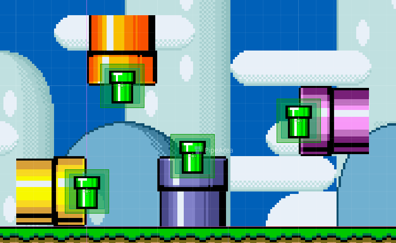

# Creating Custom Levels

## Intro

Making custom levels using Godot is relatively easy, so long as you are familiar with the Godot Editor and its interface. This tutorial will assume that you already have a basic understanding of Godot. If you are not confident in the usage of Godot. You can use these 2 guides here, to teach you where and how everything is.

Video Tutorial by GDQuest: https://www.youtube.com/watch?v=L2D1kT8zOrw&t

Article by Godot: https://docs.godotengine.org/en/stable/getting_started/introduction/index.html#toc-learn-introduction

This tutorial will also assume that you have already successfully imported the project file into Godot. You can learn how to import the project files into Godot here.

Now that you are hopefully familiar with how Godot functions. Let's get into making your first level!

## Setup
Creating a level is easy! To start we first want to make a new scene. We can do this by clicking "Scene" and then "New Scene" at the top right corner of the editor.

You should then see something like this.

Once you see that, click the "Other Node" Button, and search for a "Level" node. That will be our root node, for the level. It should look like the end castles you see in Super Mario Bros.!

Once that Level node has been added to your scene tree. We next want to add all of the required Nodes and Scenes needed to make the Level actually function! We can do this through a handy shortcut I added to make it easier and less repetitive!

Lets go to the "Mario Helper" tab, which should be at the bottom center of your window. This is an addon I made, which has some handy shortcuts, allowing us to develop content faster! The tab should look something like this.

We want to click the "Add Starting Level Nodes" button, which will automatically add our Player, Background and Tilemap nodes, and you should start to see where the level will take shape!

Your scene should now look something like this!

Now, before you do anything else! Make sure that the editor's snap grid has been set to 8x8, this is very important to make sure that everything aligns nicely!

Before we start making some levels, lets first go through what each of the nodes do.

## Starting Nodes, and what they do.

### LevelBG

The first node that was added, was the "LevelBG" Node, this is what gives the level our background, and is great if you want a simple SMW styled BG, for your level. It allows you to define a texture for the base background, give the sky a colour, or a texture, and can allow for FG's and autoscrolling, as well as some cool weather effects! Have a play around with the values and see what you can come up with!

### Player

This is Mario! ..or Luigi... or Toad.... or whoever else you decide to play as during the level! You can customize a few parameters here. Such as the style the camera, should take on. (Vertical scrolling or Horizontal Bias.), the direction the player should face (-1 for left, 1 for right.) and whether he should die faster! Morbid I know, but its really handy should you make an extra tough level, such as a Kaizo level, where the player will most likely die a lot! Other than that, you shouldnt touch many of the other values, as they were not intended to be changed, you can however change the position of where we start, simply by changing the position in the "Transform" section, or by using the move tool, and simply drag the Player node around!

### TileMap

This is the Tilemap! the most useful node in the game! it is used to define the tiles, or terrain, which all objects and characters will move around on. Since Godot 4.3, they have now introduced a new TileMapLayer node, which makes the TileMap node, deprecated. However, since most of the levels still use the standard TileMap node, since it keeps things like layer ordering consistent, it is recommended to use the standard TileMap node you get initially given if you're a beginner!

### LevelGuide

This is a useful node which is used to show a layout of a level, based on the image you give it! The images can be basic maps from SNESMaps.com or renders from LunarMagic, your choice! Just make sure to position it correctly so that the bottom of the image, is where the yellow line is, thats where the camera cannot move past.

Now that we have a basic understanding on the nodes do! Lets start making some levels!

## Building out the terrain

To start, click the TileMap node, this should open a menu at the bottom of the screen. From there, you can start clicking out each tile that you want. However, its a bit slow no?

Introducing terrains! This is used to automatically select a tile, based on its neighbours, allowing for easy creations and painting of terrain, exactly like in Super Mario Maker!

This is very easy to access, and has lots of modes which makes painting tiles far easier. like Square, Paint Bucket, and Line.

To access terrains, simply click the "Terrain" tab. This will present a choice of tiles to use at the left hand side. It should look something like this.

From here, you  can select the terrain you want to use, and can then simply paint the terrain to fit! Mind you, terrains ONLY WORK for basic tiles, SLOPES ARE NOT POSSIBLE TO BE AUTO TILED, they must be placed manually in the "TileMap" menu.

*As you can see, we are starting to see a level come together!*

And if we simply press F6, to run the scene... (Be sure to save the scene first!)

We can start testing our level!

## Enemies, Objects, Powerups, Pipes? Oh my!

Now that we have got basic terrain for our level to use, lets start to populate our level with some objects and enemies! This is trivially easy to do in Godot. To start, lets go to the "Asset Drawer" tab at the bottom of the window. This is located where "TileMap" and "Mario Helper" are.

This is the Asset Drawer! Derived from the 'Instance Dock' addon by KoBeWi, it allows us to simply drag out the objects that we would like to add onto our scene, just like in Super Mario Maker! Explore the various tabs, and see what you can add already!

Once you've added an object to the scene, have a look at the inspector for the node, the node may have some values which will allow you to further customize its behaviour! (Changing Koopa Colours, Adding wings to Galoombas, etc...)

*Our level is starting to look a bit more lively!*

If you cannot find a specific object in the Asset Drawer, try searching for it using `CTRL+SHIFT+A`, and type in its name, it may not be in the Asset Drawer, simply because it was something I didnt use too much myself, however you can add it to the Asset Drawer, by dragging and dropping the scene file, found in the FileSystem tab, into the asset drawer, hovering over a slot titled, "Drop scene to assign"

### Items in blocks

If you want to add items into blocks, so that they dispense them upon being hit, simply drag and drop the scene, from either the FileSystem or Asset Drawer, into the "item" value, in the inspector. It should look like this.

*Without an item*

*With an Item*

You can put anything you want in a block! Stars, Koopas, Clones of the player! Go wild and see what you can discover!

### Pipes
Pipes are a little bit different to setup then how your used to, to start, they do not have any included visuals, if you want a pipe to look like a pipe, youll want to place the relevant tiles in your tilemap.

*Theres plenty of pipe colours to choose from!*

From there, go to the "Misc" tab in the asset drawer, and place down the Pipe Area scene. It looks like a green pipe in the drawer.

You want to place the PipeArea halfway over the pipe. Feel free to use this image for reference.

Using the inspector, you can then customize how it behaves, and what level the pipe goes to.

The important values are: Enter Direction, Level Scene and Pipe ID. These ones control the main functions of how a pipe behave. 

Level Scenes, can easily be set by clicking the icon to the right of the text box, allowing you to simply select the scene file you want the pipe to go to, with its file path automatically being filled in.

Pipe ID is used to choose which pipe it connects to within the next level.
So in "Level 1", the Pipe with an ID of 0, will connect to the Pipe with the same ID in Level 2. 

## Finishing Up

### Music
Now that our level is nearing completion, lets give it a little life, by giving it a song!

To begin, select the root Level node in our scenes, from there, we can see lots of options to allow for further customization of our scene. Two of these values are Level Music, and Autumn Music. These two values are used by the MusicPlayer autoload, which handle the playing and transitioning of music tracks. The values used should be the AudioStreamInteractive resource. This is because it allows us to easily change between various versions, which allows us to change between the normal versions of songs, and the versions when riding yoshi, with the added drums.

Super Mario World Remastered, comes with many included tracks for each song used in a level. You can find these in `res://Resources/MusicTracks/`. From there, your song will automatically play, when the level is loaded, and will change when it differs from whats currently playing!

### Exporting
Once you are happy with your level, its time to export it! To start, lets make a LevelInfo resource, which will be used internally to keep track of a few properties relating to the level.

Depending on whether your level is to be played through the Custom Level Select or not, it will matter where you create this file. If you are making a standalone level, you will need to make the LevelInfo file at `res://Resources/LevelData/CustomLevels/` this allows the level select, to find and read the file you create, to allow for players to play your level! If you are creating the level for a campaign, with various other levels being used, you can place it wherever you like! So long as the corresponding MapPoint and MapArea files, know where that file is. 

So first, navigate to the folder you want to store your level data in, using the FileSystem. From there, you can right click and select `Create New > Resource`, then select LevelInfo, where you can then save the file with the appropriate name. From there, you can then fill out the data presented in the inspector, on the newly created LevelInfo resource.

Once your happy with everything, lets export the level! Go to the 'ModPacker' tab next to the FileSystem. This is where mods and such are packed into a nice lil pck file, which you can then share with everyone!

*It should look something like this*

from there, you wanna keep track of the files you changed / added, for the context of this guide, it should just be the level scene(s) and the `LevelInfo` resource file

To start, get the file paths of the scenes and resources you use, this can be easily done by switching to the filesystem tab and rightclicking the file you want to add, and selecting Copy Path. (NOT COPY ABSOLUTE PATH), the paste it into the "File Path to add..." field, then click "Add Path to list" thisll add it to the list at the top, repeat this for every file you want to include in the pck.

Once your happy with the list, put the name of pck file you want, in the "PCK File Name." field, then click "Export Mod!", you can find your newly exported level in "user://ExportedAddons", the user:// folder can be found by clicking `Editor > Open User Data Folder`

